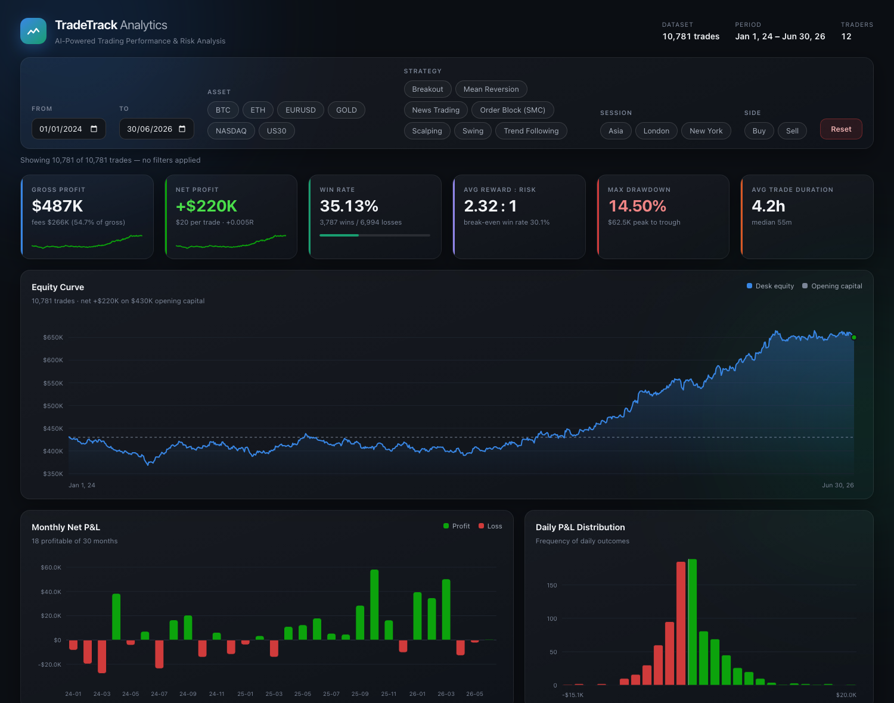
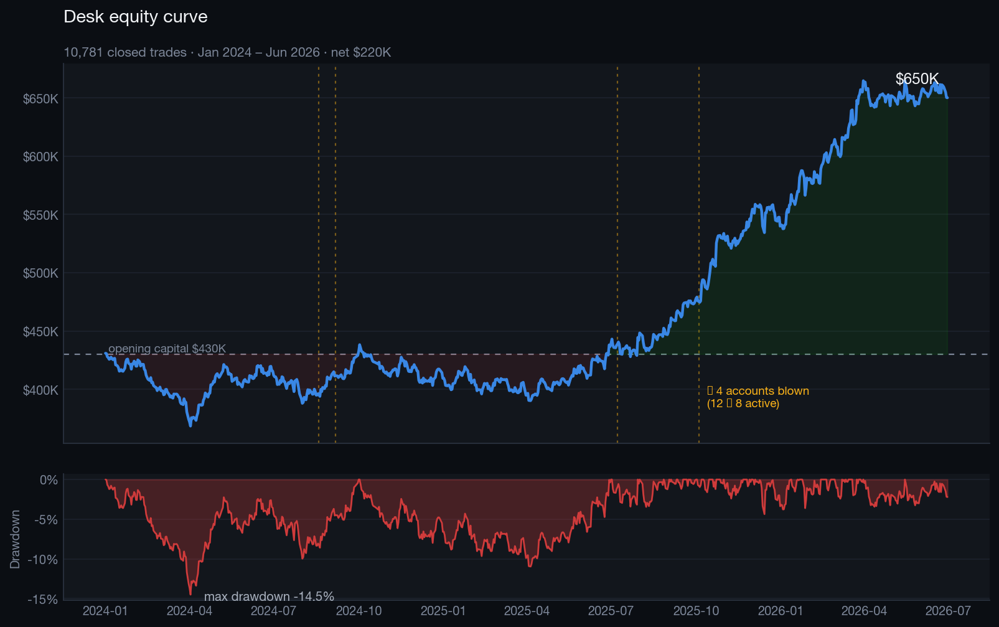
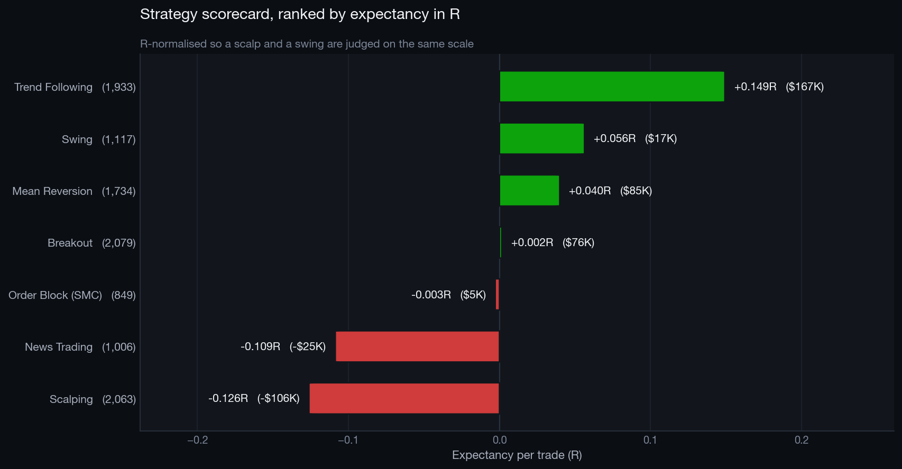
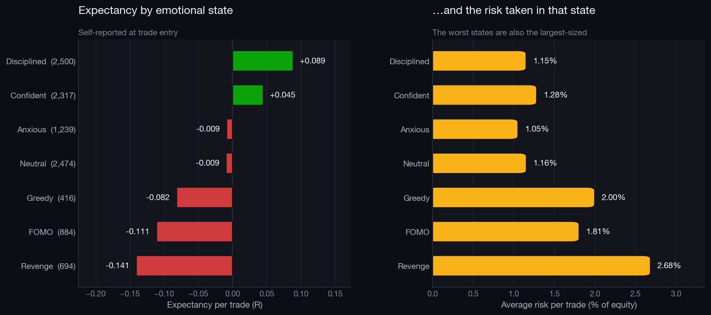
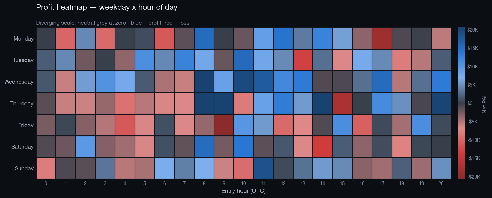
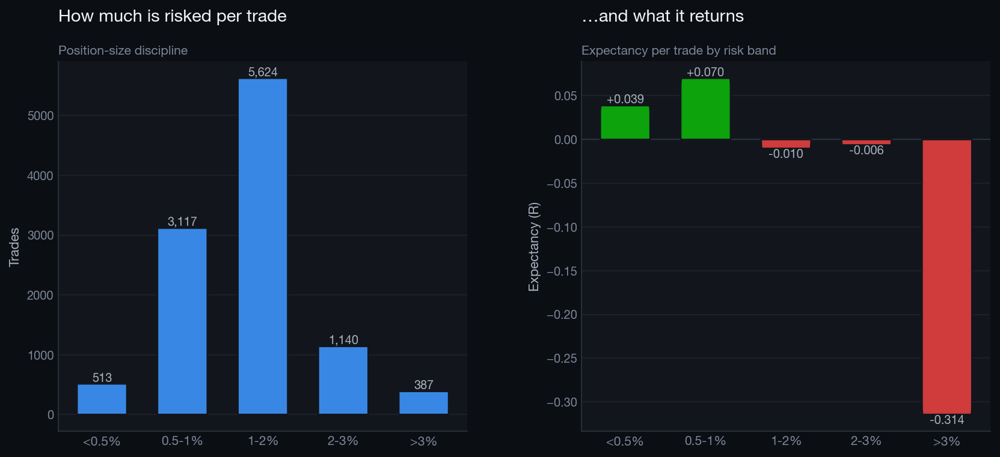
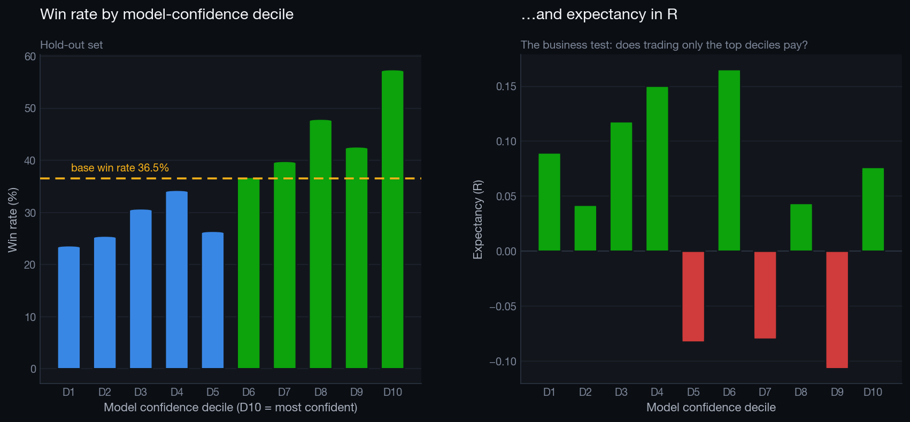

# TradeTrack Analytics
### AI-Powered Trading Performance & Risk Analysis Dashboard

An end-to-end data analytics project over **10,781 closed trades** from 12
traders across 6 instruments and 7 strategies — from data generation and
cleaning, through SQL warehousing and Python analysis, to an interactive
dashboard and a leakage-controlled machine-learning model.

<p align="left">
  
  
  
  
  
</p>



---

## The headline result

| Metric | Value | | Metric | Value |
|---|---|---|---|---|
| Closed trades | **10,781** | | Profit factor | **1.07** |
| Net P&L | **+$220,184** (+51.2%) | | Sharpe / Sortino | **0.80 / 0.95** |
| Win rate | **35.13%** | | Max drawdown | **14.50%** ($62,492) |
| Avg reward : risk | **2.32 : 1** | | Expectancy | **$20.42** (+0.005R) / trade |

**The desk is profitable, but the edge is thin — and the analysis explains
exactly where it leaks.** Fees consume **54.7% of gross profit**; one strategy is
gross-positive and net-negative purely on transaction costs; and the single
largest behavioural effect is that the worst-expectancy emotional state is also
the one traders size **2.3× larger**.

---

## Why this project is structured the way it is

Three decisions shape everything else, and they are the ones worth defending in
an interview:

**1. All performance is measured net of fees.**
Gross P&L flatters every strategy. On this dataset fees are more than half the
gross result, so any conclusion drawn from gross numbers is simply wrong. The
`Scalping` strategy is the proof: **+$15K gross, −$106K net**.

**2. Comparisons use R-multiples, not dollars.**
One `R` is the amount risked on that trade (`|entry − stop| × quantity`).
Reporting outcomes in R makes a $12 scalp and a $4,000 swing directly
comparable, and stops every ranking from merely rediscovering who traded the
biggest size.

**3. A high win rate is treated as a warning sign, not a goal.**
A trade targeting 0.9:1 must win >52% of the time just to break even. The
`<1R` band in this dataset wins **52.9%** and still **loses money**. Every
strategy is therefore judged against *its own* break-even hit rate.

---

## Project structure

```
TradeTrack-Analytics/
│
├── data/
│   ├── raw/trades_raw.csv                 11,130 rows, deliberately dirty
│   ├── processed/
│   │   ├── trades_clean.csv               10,781 trades × 77 engineered columns
│   │   ├── daily_performance.csv          day-grain mart
│   │   ├── monthly_performance.csv        month-grain mart
│   │   ├── trader_summary.csv             trader-grain mart
│   │   ├── dim_calendar.csv               date dimension
│   │   └── open_trades.csv                quarantined, not deleted
│   └── tradetrack.db                      SQLite star-schema warehouse
│
├── sql/
│   ├── 01_schema.sql                      DDL, indexes, 3 views
│   └── 02_analysis_queries.sql            21 commented analytical queries
│
├── python/
│   ├── config.py                          single source of truth
│   ├── generate_dataset.py                market + behaviour simulation
│   ├── data_cleaning.py                   cleaning & feature engineering
│   ├── kpi_engine.py                      KPI / risk metric library
│   ├── viz_theme.py                       shared chart design system
│   ├── visualizations.py                  the chart deck
│   ├── ml_model.py                        leakage-controlled classifier
│   ├── ml_expected_r.py                   expected-R objective test
│   ├── generate_insights.py               the 20 insights, computed
│   ├── load_to_sql.py                     warehouse loader + reconciliation
│   ├── run_sql_analysis.py                executes all 21 queries
│   ├── build_dashboard.py                 dashboard data layer
│   ├── build_notebook.py                  generates the notebook
│   └── run_all.py                         full pipeline orchestrator
│
├── notebooks/TradeTrack_Analytics.ipynb   the analytical narrative
│
├── dashboard/                             zero-dependency web dashboard
│   ├── index.html · styles.css · app.js · data.js
│
├── powerbi/
│   ├── measures.dax                       70+ DAX measures
│   ├── tradetrack_theme.json              importable dark theme
│   ├── data_model.md                      star schema & modelling notes
│   └── README.md                          page-by-page visual spec
│
├── reports/
│   ├── business_insights.md               20 insights (computed, not typed)
│   ├── kpi_summary.json                   machine-readable KPIs
│   ├── sql_analysis_results.md            executed output of all 21 queries
│   ├── ml_model_report.md                 model card
│   ├── ml_expected_r_report.md            objective comparison
│   └── data_quality_report.md             what was cleaned, and why
│
├── images/                                16 rendered charts
├── requirements.txt
└── README.md
```

---

## Quick start

```bash
git clone <repo-url>
cd TradeTrack-Analytics

python -m venv venv && source venv/bin/activate   # Windows: venv\Scripts\activate
pip install -r requirements.txt

python python/run_all.py          # full pipeline, ~30 seconds
```

Then:

```bash
open dashboard/index.html                          # interactive dashboard
jupyter notebook notebooks/TradeTrack_Analytics.ipynb
```

Useful flags:

```bash
python python/run_all.py --skip-generate           # reuse the existing dataset
python python/run_all.py --only ml_model           # rerun one stage
```

To run the same analysis against **real trades** from the TradeTrack web app:

```bash
python python/import_journal.py --capital 5000
```

It honours the app's `quantity / 100 = 1 unit` convention, reconciles the stored
P&L against a recomputation to prove the mapping, and prints sample-size and
missing-data warnings **before** the numbers — a 13-trade Sharpe ratio is
arithmetically correct and practically meaningless.

The pipeline is **fully deterministic** — a complete regeneration reproduces
every figure in this README byte-for-byte (seeded at `config.RANDOM_SEED`).

---

## The pipeline

| Stage | Module | Output |
|---|---|---|
| 1 | `generate_dataset.py` | 11,130 raw rows with injected defects |
| 2 | `data_cleaning.py` | 10,781 clean trades × 77 columns |
| 3 | `load_to_sql.py` | SQLite warehouse + reconciliation checks |
| 4 | `run_sql_analysis.py` | all 21 queries executed and rendered |
| 5 | `kpi_engine.py` | KPI / risk metrics |
| 6 | `visualizations.py` | 15-chart deck |
| 7 | `ml_model.py` | classifier + model card |
| 8 | `ml_expected_r.py` | expected-R model, objective comparison |
| 9 | `generate_insights.py` | 20 business insights |
| 10 | `build_dashboard.py` | dashboard data layer |

### 1 · The dataset is simulated, not sampled

Real retail blotters are private. Rather than sampling columns independently —
which yields data with no discoverable structure — `generate_dataset.py`
simulates the **process** that creates a blotter:

- **GBM price paths** per asset with volatility clustering, so entry prices,
  stop distances and targets are anchored to a plausible market.
- **Win probability anchored to the RR-implied break-even rate**
  (`p = 1/(1+RR) + edge`). This is what keeps the data honest: a 4:1 target
  mechanically hits ~20% of the time, so expectancy per trade is
  `edge × (1+RR)` and no strategy can have a high win rate *and* a high RR.
- **Per-trader behavioural profiles** — skill edge, discipline, risk appetite.
- **A psychology feedback loop** — losing streaks raise the probability of
  Revenge/FOMO states, which raise position size *and* lower win probability.
- **Account blow-ups**: a trader who loses 85% of their opening balance stops
  trading, which produces genuine survivorship in the desk-level series.

The result contains real, *recoverable* signal that the SQL, Python and
dashboard layers then rediscover analytically.

### 2 · Cleaning is a real pipeline stage

The raw export carries the defects a production journal actually produces, and
each is handled with a documented decision rather than a silent fix:

| Defect | Detection | Treatment |
|---|---|---|
| 180 duplicate rows | exact match, then repeated `trade_id` | drop, keep first |
| 156 numbers as `"1,250.75"` | regex on numeric columns | strip separators, cast |
| 460 casing/whitespace variants | value outside canonical domain | map to canonical label |
| 45 impossible durations (≤ 0) | `duration <= 0` | recompute from timestamps |
| 29 corrupted prices | **two independent tests** (below) | flag and exclude |
| 140 open trades | no exit recorded | quarantine, **do not delete** |
| 258 missing emotional states | null | `'Unspecified'`, kept in the sample |

The outlier detection is worth a note. A **robust MAD z-score** on log price is
used rather than a mean/std z-score, because the contaminating values are exactly
the extremes that inflate a standard deviation and then hide inside their own
inflated threshold. That test alone still missed 14 rows — so a second,
structural test enforces the invariant that a long's stop must sit *below* its
entry and its target *above*. Two independent tests catch what either misses.

### 3 · SQL layer — 21 queries, all executed on every run

`sql/02_analysis_queries.sql` is a library, not a snippet dump:
gaps-and-islands streak detection, window-function drawdown curves, `LAG`-based
month-over-month growth, and a risk/reward table that compares each RR band's
actual win rate to the break-even rate it mathematically requires.

`run_sql_analysis.py` parses the file, **executes every query on every pipeline
run**, and renders the results to `reports/sql_analysis_results.md`. A query
that stops parsing or returns nothing fails the build rather than quietly
rotting.

### 4 · Machine learning — the guardrails are the point

**Question:** using only what is knowable *at the moment of entry*, will this
trade close profitably?

| Model | Accuracy | Majority baseline | ROC-AUC | Top-decile win rate |
|---|---|---|---|---|
| **Random Forest** | 0.602 | 0.635 | **0.618** | **57.2%** (vs 36.5% base) |
| Gradient Boosting | 0.635 | 0.635 | 0.605 | 50.2% |

- **31 post-close columns are hard-banned**, enforced by a runtime assertion
  that fails the build if one reaches the feature matrix. `account_balance` is
  shifted one trade back per trader, because the stored value is the balance
  *after* the trade settled.
- **The split is chronological**, never random — a random split lets the model
  learn from the future.
- **Accuracy is explicitly not the headline.** Only 36% of hold-out trades win,
  so predicting "Loss" every time scores 63.5% while being useless.

**And the honest limitation, stated in the model card:** win rate rises cleanly
across the confidence deciles, but **expectancy in R does not**. The model is
correctly learning that low-RR trades win more often — and those trades are
worth less. Ranking by *probability of winning* therefore selects the wrong
trades.

### 5 · Testing that limitation instead of just asserting it

`ml_expected_r.py` trains a **regression on `r_multiple`** — the quantity the
desk actually cares about — on the same features, the same chronological split
and the same leakage bans, then compares the two objectives head to head on the
same hold-out rows.

| Ranking signal | Spearman ρ vs actual R | Top 25% | Top 50% |
|---|---|---|---|
| **Expected R** | **+0.067** (p = 0.002) | **+0.112R** | **+0.116R** |
| P(win) | −0.016 | +0.009R | +0.019R |
| *Take every trade* | — | *+0.041R* | *+0.041R* |

**The claim holds.** Ranking by win probability correlates *negatively* with the
R actually earned — it sorts trades by how often they win, which is close to the
opposite of sorting them by what they are worth.

Two things are reported rather than buried. At the **top 10%** the P(win) model
looks better (+0.074R vs +0.056R) — that slice is only 215 trades and is the
noisiest number in the comparison, and the verdict deliberately does not rest on
it. And the effect is **thin**: even at its best, expected-R lifts expectancy
from +0.041R to ~+0.116R while discarding half the trades, on one chronological
hold-out. It is evidence that the *objective* was wrong, not a finished trading
signal.


---

## Selected findings

Full detail in **[`reports/business_insights.md`](reports/business_insights.md)** — all 20 insights, every number computed
from the data rather than typed by hand.

| # | Finding | Evidence |
|---|---|---|
| 2 | **The improving equity curve is survivorship, not skill.** | 4 of 12 accounts blew up; 2024 = −$20.6K across 12 traders, H2-2025+ = +$213.6K across 8 |
| 3 | **One hour carries the desk.** | 08:00 UTC (London open): +0.212R, 42.6% WR, $113.3K — 51% of all profit |
| 8 | **Scalping is gross-positive, net-negative.** | +$15.0K gross → −$105.8K net; fees are 11.7% of risk vs 3.6% elsewhere |
| 9 | **Fees consume over half of gross profit.** | $266K of $487K gross |
| 10 | **High win rate ≠ profitable.** | `<1R` band: 52.9% win rate, −0.113R expectancy |
| 11 | **Revenge trading is the most destructive behaviour.** | −0.141R vs +0.089R disciplined — at **2.3× the position size** |
| 13 | **Quality collapses after the 8th trade of the day.** | 9th+: −0.209R at 24.6% WR, and the *largest* average size |
| 14 | **Textbook disposition effect.** | Losers held 286 min vs 198 min for winners (+44%) |

---

## Dashboard

`dashboard/index.html` — a **zero-dependency** dark fintech dashboard. No build
step, no CDN, no network access; open the file and it runs.

- **6 animated KPI cards** — gross, net, win rate, avg RR, max drawdown, duration
- **10 interactive charts** — equity curve with crosshair, monthly P&L, daily
  distribution, asset/strategy/session breakdowns, hour-of-day, risk bands, and
  best/worst-day tables
- **5 live filters** — date range, asset, strategy, session, side — recomputing
  every KPI and chart over all 10,781 trades in a single pass
- Glassmorphism surfaces, responsive to mobile, and `prefers-reduced-motion`
  honoured

The data layer is **columnar and dictionary-encoded**: `df.to_json(orient="records")`
would ship several megabytes of repeated key names, whereas encoding each
categorical as an integer index into a lookup table cuts the payload to 705 KB —
and it is also the layout the client-side filter loop wants.

### Design system

The charts are not styled by eye. The categorical palette is **validated**:
worst adjacent colour-vision-deficiency separation ΔE 8.4, worst normal-vision
separation ΔE 19.3, and all eight hues clear 3:1 contrast against the `#12161C`
surface. Profit/loss uses **reserved status colours** rather than categorical
slots — profit-vs-loss is a *state*, not a series — and every P&L figure is also
sign-labelled, so colour never carries the meaning alone.

---

## Chart deck

| | |
|---|---|
|  |  |
|  |  |
|  |  |

All 15 charts are in [`images/`](images/).

---

## Tech stack

| Layer | Tools |
|---|---|
| **Data generation** | NumPy (GBM simulation), pandas |
| **Cleaning & features** | pandas, NumPy — 77 engineered columns |
| **Warehouse** | SQLite star schema, 7 indexes, 3 views, window functions |
| **Analysis** | pandas, SciPy, Jupyter |
| **Visualisation** | Matplotlib (custom theme), Plotly (interactive exports) |
| **ML** | scikit-learn — Random Forest, Gradient Boosting, XGBoost (optional) |
| **Dashboard** | Vanilla JS + hand-rendered SVG, zero dependencies |
| **BI** | Power BI — DAX measure library, importable theme, model spec |

---

## Reproducibility

- Every stage is seeded and deterministic; a full rebuild reproduces every
  figure in this README exactly.
- The warehouse loader **reconciles** row counts and P&L totals against the
  source CSV and aborts on drift.
- All 21 SQL queries execute on every run.
- Every number in `business_insights.md` is computed by
  `generate_insights.py`, so the report cannot drift from the data.
- The notebook is generated from `build_notebook.py` and executed end-to-end;
  it independently reimplements the KPI calculations and **agrees with
  `kpi_engine.py` to the cent** — a cross-check, not a copy.

---

## Future improvements

- **Walk-forward validation** with an expanding window instead of a single
  chronological split.
- **Per-venue fee modelling** to quantify the commission-renegotiation case,
  which is the largest single P&L lever identified.
- **Market-regime features** (volatility, trend state) to test whether strategy
  edges are conditional on regime.
- **dbt + Postgres** in place of the SQLite warehouse, with schema tests.
- **Streamlit or FastAPI serving layer** so the model scores trades live.
- **Survivorship-adjusted cohort reporting** as a first-class dashboard view.

---

## License

MIT — see [LICENSE](LICENSE).

---

<sub>Built as a portfolio project demonstrating the full analytics lifecycle:
data engineering, SQL warehousing, statistical analysis, machine learning,
dashboard design and stakeholder communication.</sub>
