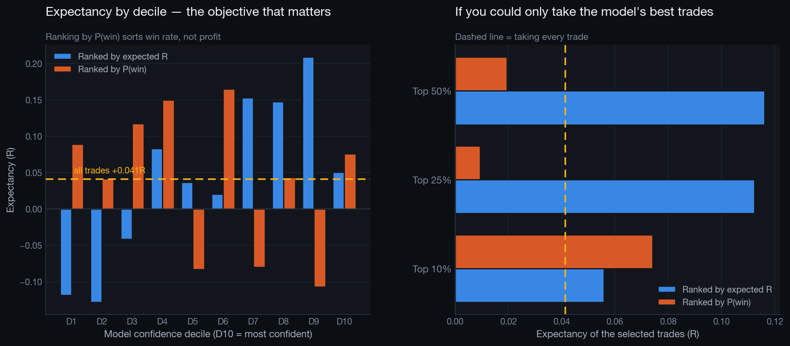

# Expected-R Model — Testing the Classifier's Stated Limitation

`ml_model.py` predicts P(win), and its model card claims that ranking trades by win probability selects the *wrong* trades — because low reward:risk trades win often and are worth little.

This report tests that claim rather than asserting it: a regression on `r_multiple` is trained on the same features, the same chronological split and the same leakage bans, then both models are evaluated on the same hold-out rows.

## Setup

- Chronological split at `2025-11-20 05:15:13` — 8,624 train / 2,157 test
- Target `r_multiple` is post-close: it is the **label**, and a runtime assertion confirms it never appears in the feature matrix.
- The **training** target is winsorised at the 1st/99th percentile so a few extreme R outliers cannot dominate the squared-error loss. The test set is left unclipped, so evaluation is on real outcomes.

## Regression quality

| Metric | Value |
|---|---|
| R² | 0.0012 |
| MAE | 1.2916 R |
| Spearman ρ (predicted vs actual R) | **+0.0673** (p=0.0018) |
| Spearman ρ for the P(win) model | -0.0159 |

**A near-zero R² is expected and is not a failure.** Individual trade outcomes are dominated by market noise; no feature set available at entry can explain the variance of a single trade. What matters for trade selection is not variance explained but **rank ordering** — whether the trades the model puts at the top actually earn more. Spearman ρ measures exactly that.

## The decisive comparison

Taking every hold-out trade returns **+0.0413R** (36.5% win rate). If you could only take the trades each model ranks highest:

| Selection | Ranked by expected R | Ranked by P(win) |
|---|---|---|
| Top 10% (215 trades) | **+0.0558R** (30.7% WR) | +0.0741R (57.2% WR) |
| Top 25% (539 trades) | **+0.1124R** (34.5% WR) | +0.0094R (50.1% WR) |
| Top 50% (1,078 trades) | **+0.1162R** (35.9% WR) | +0.0194R (44.9% WR) |

### Verdict: CONFIRMED

Judged across all three selection sizes rather than the top decile alone — the top decile is only 215 trades and is the noisiest number here, so resting a conclusion on it would repeat the sample-size mistake this project warns about elsewhere.

- Expected-R beats taking every trade in **3/3** selection sizes.
- Expected-R beats P(win) ranking in **2/3** selection sizes.
- Rank ordering across **all** hold-out rows: Spearman ρ = **+0.0673** (p=0.0018) for expected-R versus **-0.0159** for P(win).

**The claim in the classifier's model card holds.** Ranking by win probability correlates *negatively* with the R actually earned (ρ = -0.0159) — it sorts trades by how often they win, which is close to the opposite of sorting them by what they are worth. Ranking by predicted R correlates positively and significantly (ρ = +0.0673, p=0.0018).

**Where the two disagree, stated plainly.** At the top 10% the P(win) model looks better (+0.0741R vs +0.0558R). At the top 25% and top 50% — slices roughly 2.5x and 5x larger, and correspondingly more reliable — the expected-R model wins decisively (+0.1124R vs +0.0094R, and +0.1162R vs +0.0194R). The top-decile result is not suppressed here because it is inconvenient; it is reported and weighted for what it is — the smallest sample in the table.

**The honest size of the effect.** Even at its best the expected-R model lifts expectancy from +0.0413R to about +0.1162R while discarding half to three-quarters of the trades. That is a real improvement in rank ordering, but it is a thin edge on one chronological hold-out, and it is nowhere near strong enough to justify trading on the model alone. It should be treated as evidence that the *objective* was wrong, not as a finished signal.

### Decile detail — expected-R model

| decile   |   trades |   win_rate |   expectancy_r |   total_r |
|:---------|---------:|-----------:|---------------:|----------:|
| D1       |      216 |     0.3796 |        -0.1185 |  -25.5994 |
| D2       |      216 |     0.3657 |        -0.1281 |  -27.6800 |
| D3       |      215 |     0.3442 |        -0.0413 |   -8.8778 |
| D4       |      216 |     0.4074 |         0.0834 |   18.0216 |
| D5       |      216 |     0.3565 |         0.0370 |    7.9903 |
| D6       |      215 |     0.3767 |         0.0208 |    4.4744 |
| D7       |      216 |     0.3611 |         0.1528 |   32.9973 |
| D8       |      215 |     0.3674 |         0.1479 |   31.7926 |
| D9       |      216 |     0.3843 |         0.2087 |   45.0862 |
| D10      |      216 |     0.3056 |         0.0507 |   10.9487 |

### Decile detail — P(win) model

| decile   |   trades |   win_rate |   expectancy_r |   total_r |
|:---------|---------:|-----------:|---------------:|----------:|
| D1       |      216 |     0.2361 |         0.0894 |   19.3085 |
| D2       |      216 |     0.2546 |         0.0418 |    9.0330 |
| D3       |      215 |     0.3070 |         0.1177 |   25.3143 |
| D4       |      216 |     0.3426 |         0.1501 |   32.4212 |
| D5       |      216 |     0.2639 |        -0.0827 |  -17.8573 |
| D6       |      215 |     0.3674 |         0.1652 |   35.5102 |
| D7       |      216 |     0.3981 |        -0.0800 |  -17.2822 |
| D8       |      215 |     0.4791 |         0.0434 |    9.3367 |
| D9       |      216 |     0.4259 |        -0.1069 |  -23.0911 |
| D10      |      216 |     0.5741 |         0.0762 |   16.4607 |

## What this means in practice

Whatever the verdict, one conclusion is stable across both models: **the reliable, actionable edge in this dataset is behavioural, not predictive.** Cutting the loss centres the analysis already identified — the highest-cost strategy, the pre-London hours, revenge trades, the 9th-plus trade of the day — is a larger and far more certain P&L improvement than any model that tries to time individual trades.

