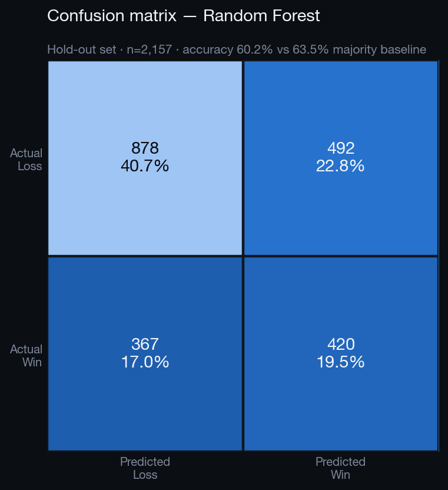
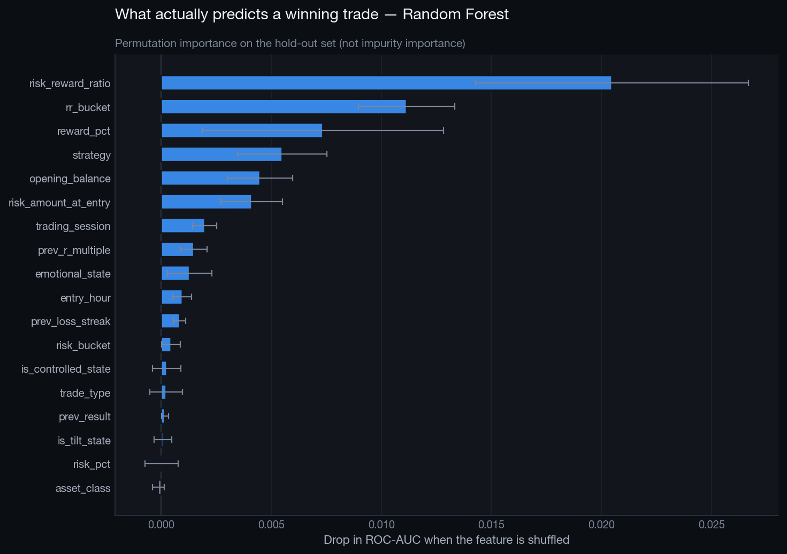
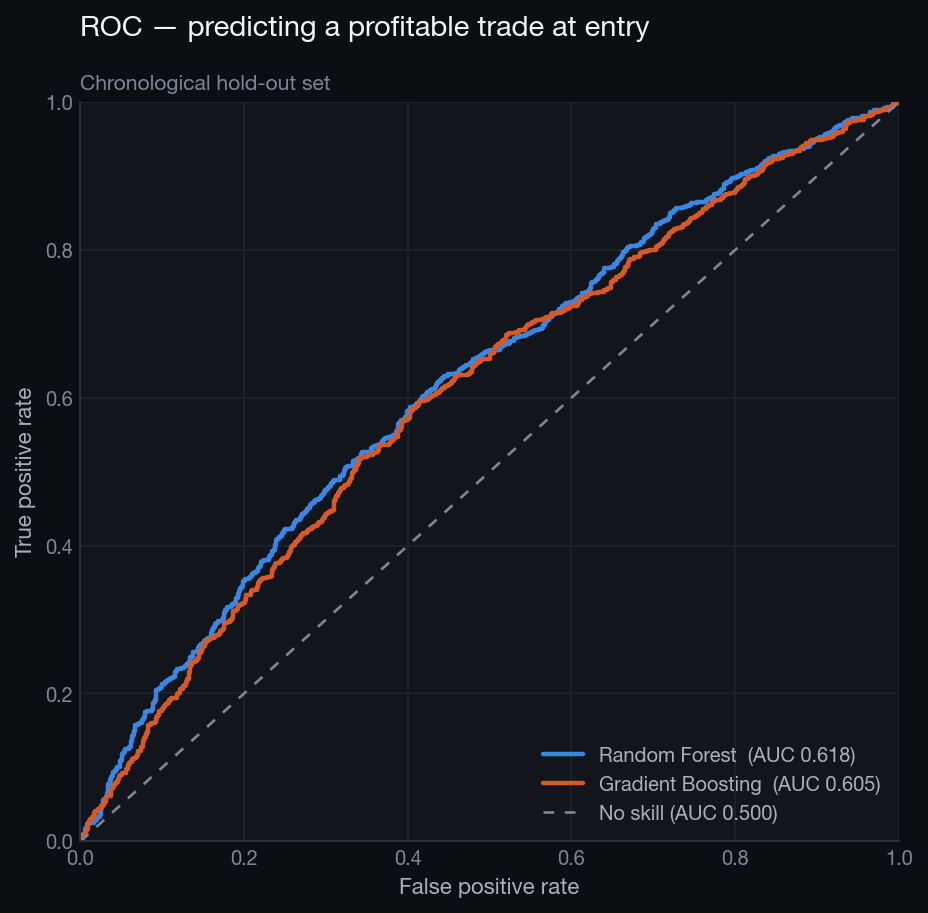

# Machine Learning — Trade Outcome Classifier

## Problem

Binary classification: will this trade close profitably (net of fees), using only information available **at the moment of entry**?

## Guardrails

- **Chronological split** at `2025-11-20 05:15:13` — 8,624 train / 2,157 test. A random split would let the model learn from the future.
- **31 post-close columns are hard-banned** (`net_profit`, `r_multiple`, `trade_duration_min`, the running streaks and equity columns, …). A runtime assertion fails the build if any of them reaches the feature matrix.
- `account_balance` is shifted one trade back per trader, because the stored value is the balance *after* the trade settled.

## Results

| Model | Accuracy | Majority baseline | Precision (Win) | Recall (Win) | F1 (Win) | ROC-AUC | Brier |
|---|---|---|---|---|---|---|---|
| Random Forest | 0.602 | 0.635 | 0.461 | 0.534 | 0.494 | 0.618 | 0.2396 |
| Gradient Boosting | 0.635 | 0.635 | 0.499 | 0.248 | 0.331 | 0.605 | 0.2263 |

### Confusion matrix — Random Forest

| | Predicted Loss | Predicted Win |
|---|---|---|
| **Actual Loss** | 878 | 492 |
| **Actual Win**  | 367 | 420 |

```
              precision    recall  f1-score   support

        Loss       0.71      0.64      0.67      1370
         Win       0.46      0.53      0.49       787

    accuracy                           0.60      2157
   macro avg       0.58      0.59      0.58      2157
weighted avg       0.62      0.60      0.61      2157
```

## Reading the accuracy number honestly

Only 36.5% of hold-out trades are winners, so a model that predicts "Loss" every time scores 63.5% accuracy while being useless. The measures that matter are ROC-AUC (0.618, where 0.5 is a coin flip) and whether the flagged trades actually earn more.

### Does the model make money?

| Trade selection | Win rate | Expectancy (R) |
|---|---|---|
| All hold-out trades | 36.49% | +0.0413 |
| Top confidence quartile | 50.09% | +0.0094 |
| Top confidence decile | 57.21% | +0.0741 |

### Decile lift

| decile   |   trades |   win_rate |   expectancy_r |
|:---------|---------:|-----------:|---------------:|
| D1       |      216 |     0.2361 |         0.0894 |
| D2       |      216 |     0.2546 |         0.0418 |
| D3       |      215 |     0.3070 |         0.1177 |
| D4       |      216 |     0.3426 |         0.1501 |
| D5       |      216 |     0.2639 |        -0.0827 |
| D6       |      215 |     0.3674 |         0.1652 |
| D7       |      216 |     0.3981 |        -0.0800 |
| D8       |      215 |     0.4791 |         0.0434 |
| D9       |      216 |     0.4259 |        -0.1069 |
| D10      |      216 |     0.5741 |         0.0762 |

## Top predictive features

Permutation importance on the hold-out set (drop in ROC-AUC when the column is shuffled):

| feature              |   importance |     std |
|:---------------------|-------------:|--------:|
| risk_reward_ratio    |      0.02048 | 0.00620 |
| rr_bucket            |      0.01115 | 0.00220 |
| reward_pct           |      0.00734 | 0.00548 |
| strategy             |      0.00550 | 0.00202 |
| opening_balance      |      0.00449 | 0.00148 |
| risk_amount_at_entry |      0.00411 | 0.00139 |
| trading_session      |      0.00198 | 0.00055 |
| prev_r_multiple      |      0.00148 | 0.00061 |
| emotional_state      |      0.00128 | 0.00101 |
| entry_hour           |      0.00096 | 0.00043 |
| prev_loss_streak     |      0.00084 | 0.00028 |
| risk_bucket          |      0.00045 | 0.00043 |
| is_controlled_state  |      0.00025 | 0.00064 |
| trade_type           |      0.00022 | 0.00075 |
| prev_result          |      0.00016 | 0.00016 |

## Interpretation

The signal the model finds is **behavioural and structural, not predictive of the market**: planned reward:risk (which mechanically sets the hit rate), the trader's own identity, emotional state at entry, session and the tilt indicators. That is the correct result — the edge in a trading journal lives in execution discipline, not in forecasting price. A model claiming to forecast the market from a blotter would be a leakage bug, not a discovery.

### The important caveat: win rate is not the objective

Win rate climbs cleanly across the confidence deciles (23.6% in D1 to 57.4% in D10), but **expectancy in R does not climb with it** — the decile table above is close to flat, and some high-confidence deciles are negative.

That is not a broken model, it is the model correctly learning an identity we already proved in SQL: a trade with a near-1:1 target hits far more often than a 4:1 target, and it is also worth far less when it does. Ranking trades by *probability of winning* therefore preferentially selects low-RR trades, whose expectancy is poor once fees are paid.

**Consequence for deployment:** this classifier should not be used as a trade filter on its own. The correct target is expected R — a regression on `r_multiple`, or a classifier on `r_multiple > 0` weighted by the R actually earned. That is the first item in Future Improvements, and it is the difference between a model that looks good on a slide and one that makes money.







